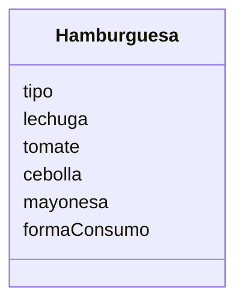

Un restaurante quiere ofrecer hamburguesas
Los clientes pueden elegir entre hamburguesa de: res, pollo
o vegetariana.
Los clientes pueden agregar extras como: lechuga, tomate, 
cebolla y mayonesa
Ademas los clientes pueden decidir comer en el restaurante 
o llevar su pedido

# Analisis: 

### Requisitos: 
- Ofrece hamburguesas de res, pollo o vegetarianas
- Se puede agregar lechuga
- Se puede agregar tomate
- Se puede agregar cebolla
- Se puede agregar mayonesa
- Se puede comer en el restaurante o llevar el pedido 

### Objetos: 
- Hamburguesa

### Acciones:
- (No hay acciones)

## Diseño:

Clases:
- Hamburguesa:
    - Nombre: Hamburguesa
    - Atributos:
        - tipo
        - lechuga
        - tomate
        - cebolla
        - mayonesa
        - formaConsumo
    - Métodos:
        - (No hay métodos)

