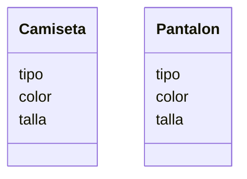

Una tienda de ropa quiere ofrecer camisetas y pantalones
Los clientes pueden elegir entre: camiseta
de manga corta o larga y pantalón de mezclilla o tela
Las camisetas pueden ser de color rojo, azul o verde
y los pantalones de color negro, gris o blanco
Las camisetas tienen las tallas: S, M, L, XL
Los pantalones tienen las tallas desde la 32 hasta la 44

# Analisis: 

### Requisitos: 
- Ofrece camisetas de manga corta o larga
- Ofrece pantalones de mezclilla o tela
- Camisetas de color: rojo, azul o verde
- Pantalones de color: negro, gris o blanco
- Camisetas tallas: S, M, L, XL
- Pantalones: talla 32 a la 44

### Objetos: 
- Camiseta
- Pantalon

### Acciones:
- (No hay acciones)

## Diseño:

Clases:
- Camiseta:
    - Nombre: Camiseta
    - Atributos:
        - tipo
        - color
        - talla
    - Métodos:
        - (No hay métodos)
- Pantalon:
    - Nombre: Pantalon 
    - Atributos:
        - tipo
        - color
        - talla
    - Métodos:
        - (No hay métodos)

