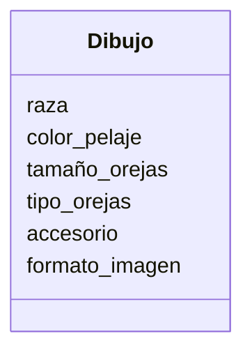

Estas diseñando una app para dibujar de perros con IA 
los usuarios pueden seleccionar características como 
la raza (por ejemplo, labrador o pastor alemán), el color 
del pelaje, el tamaño y el tipo de orejas.
Además, pueden agregar hasta dos accesorios, como sombreros 
o gafas.
El dibujo final puede descargarse en formato PNG o JPG.

# Analisis: 

### Requisitos: 
- Elegir raza de perro
- Elegir color de pelaje
- Elegir tamaño de orejas
- Elegir tipo de orejas
- Agregar accesorios: sombrero, gafas
- Elegir formato de imagenes: PNG O JPG

### Objetos: 
- Dibujo IA

### Acciones:
- (No hay acciones)

## Diseño:

Clases:
- Dibujo:
    - Nombre: Dibujo
    - Atributos:
        - raza
        - color_pelaje
        - tamaño_orejas
        - tipo_orejas
        - accesorio
        - formato_imagen
    - Métodos:
        - (No hay métodos)

