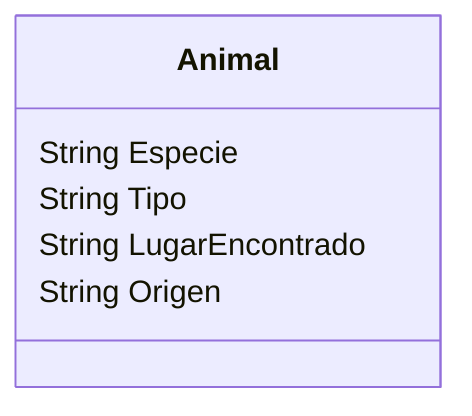

# ZOOLOGICO
Un zoológico quiere llevar un registro de los animales que llegan 
a sus instalaciones.
Necesitan registrar su especie, tipo y lugar donde los encontraron.
Los animales del zoológico pueden ser mamíferos, reptiles o aves.
El origen de todos los animales es "feral". 
Este zoológico cuenta con 2 mamíferos, 1 reptil y 1 ave

## Requisitos: 
- Registrar animales
- Registrar los atributos de cada animal 
- El origen de todos es "feral"

## Caracteristicas 
- Animal
  - Especie
  - Tipo
  - LugarEncontrado
  - Origen 

## Acciones
- (No hay acciones)

