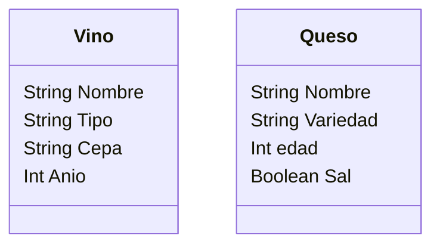

# VINOTECA
Una vinoteca quiere registrar los vinos y quesos que ofrecen.
De cada vino se necesita registrar su nombre, tipo, cepa y 
año de producción.
De cada queso se necesita registrar su nombre, variedad, 
edad y si lleva sal.
La vinoteca tiene en su inventario 4 vinos y 3 quesos 

## Requisitos:
- Registrar los vinos
- Registrar los quesos
- Registrar los atributos de cada vinmo
- Registrar los atributos de cada queso

## Caracteristicas
- Vino
  - Nombre
  - Tipo
  - Cepa
  - Anio

- Queso
  - Nombre
  - Variedad
  - Edad
  - Sal

## Acciones
- (No hay acciones)

## Diagrama de clases

