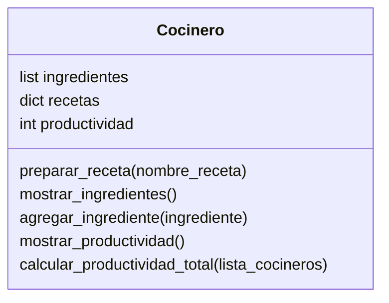

Imagina un sistema que modela el trabajo de cocineros en una cocina profesional.
Cada cocinero tiene tres elementos clave:

- Una lista de ingredientes disponibles.
- Un conjunto de recetas definidas que puede preparar
- Un contador de productividad, que aumenta cada vez que prepara una receta con éxito. Si hay más de un cocinero, sus puntos individuales
  pueden sumarse para obtener una métrica agregada de productividad.

# Análisis
## Requisitos:

- Crear un cocinero.
- Cada cocinero tiene:
  - Una lista de ingredientes disponibles.
  - Un conjunto de recetas definidas que puede preparar.
  - Un contador de productividad (número de recetas preparadas con éxito).
- Las recetas disponibles en el sistema son: Pan, pizza, galleta
- Si el cocinero tiene todos los ingredientes, puede preparar la receta con éxito 
- Si no tiene los ingredientes necesarios, falla.
- Si hay varios cocineros, se puede obtener una productividad conjunta 

# Objetos:
- Cocinero

# Características:

- Cocinero: `ingredientes`, `recetas`, `productividad` 

## Acciones:
- Cocinero: `preparar_receta(nombre_receta)`, `mostrar_ingredientes()`, `agregar_ingrediente()`
            `mostrar_productividad()`, `calcular_productividad_total(cocineros)`

