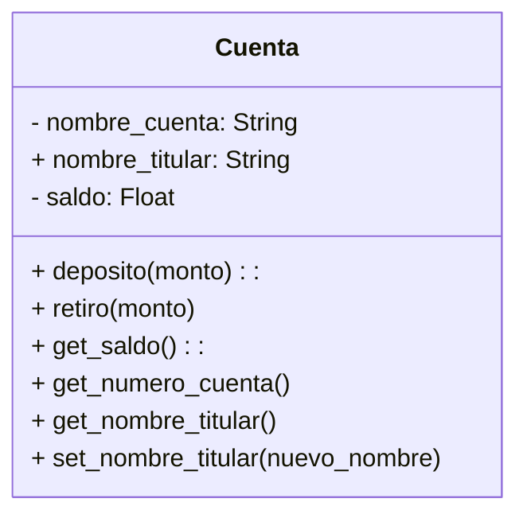

# EJERCICIO 1
Un banco necesita desarrollar un módulo para gestionar cuentas bancarias. Cada cuenta tiene las siguientes caracteristicas:
- saldo: Es un dato privado. Solo puede consultar. Se puede modificar únicamente a través de deposito y retiro
- deposito: Permite ingresar dinero, incrementando el saldo.
- retiro: Permite retirar dinero, siempre y cuando el saldo disponible sea suficiente.
- número de cuenta: Es privado. Puede consultarse, pero no puede modificarse una vez asignado.
- nombre del titular: Es público. Puede consultarse y modificarse libremente.

## Analisis:
### Requisitos:
- El saldo solo puede consultarse, no modificarse directamente
- Con el deposito se incrementara el saldo
- Con el retiro se decrementara el saldo si el saldo es suficiente
- Tiene un nombre de titular publico
- Tiene un numero de cuenta
- El numero de cuenta es privado, no puede modificarse solo consultarse
- El nombre del titular puede consultarse y modificarse libremente 
### Objetos:
- Cuenta:
### Caracteristicas:
- Cuenta:
  - numero_cuenta: String
  - nombre_titular: String
  - saldo: float
### Acciones:
- Cuenta:
    - deposito(monto):
    - retiro(monto)
    - get_saldo():
    - get_numero_cuenta()
    - get_nombre_titular()
    - set_nombre_titular()
### Diagrama de clases:

