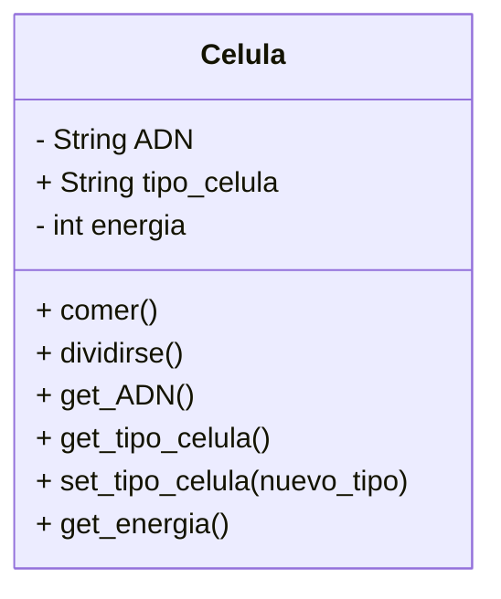

# Ejercicio 2 
Un médico necesita simular el comportamiento de una célula. Cada célula debe cumplir con las siguientes características:
- ADN: Se puede consultar pero no puede cambiar.
- tipo de célula: Puede consultarse y modificarse libremente.
- energía: Es un dato privado. Puede aumentar o disminuir, únicamente mediante las acciones de comer o dividirse.

## Analisis
### Requisitos:

- El ADN solo puede consultarse, no modificarse directamente.
- El tipo de célula puede consultarse y modificarse libremente.
- La energía es privada y solo puede cambiar mediante las acciones de comer o dividirse

### Objetos:
- Celula
### Características:
- Celula:
    - ADN: String
    - tipo_celula: String
    - energia: int

### Acciones:
- Celula:
    - comer(): 
    - dividirse(): 
    - get_ADN(): 
    - get_tipo_celula(): 
    - set_tipo_celula(nuevo_tipo): 
    - get_energia(): 

### Diagrama de clases:

