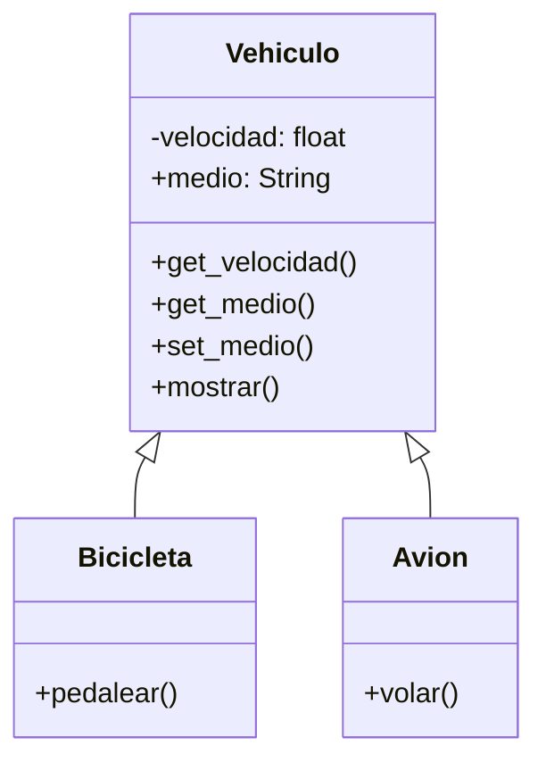

# EJERCICIO 1
Una empresa de transporte desea desarrollar una simulación que represente el comportamiento de sus distintos vehículos.
Todo vehículo posee las siguientes características:

- velocidad: Es un dato protegido. Puede consultarse, pero solo modificarse mediante acciones específicas.
- medio: Representa el entorno en el que se desplaza el vehículo (por ejemplo, terrestre, acuático, aéreo). Puede consultarse y modificarse libremente.

Existen dos tipos de vehículos con características específicas:
- Bicicleta: Incrementar su velocidad mediante la acción de pedalear.
- Avión: Incrementar su velocidad mediante la acción de volar.

## ANALSISIS

### REQUISITOS:
- Los vehiculos tiene una velocidad protegida, se modifica solo mediante acciones especificas
- Los vehiculos tienen un medio de desplazamiento libre de consultarse y modificarse
- Bicicleta es un tipo de vehiculo
- La bicicleta aumenta su velocidad al pedalear
- Avion es un tipo de vehiculo
- El avion aumenta su velocidad al volar
- Bicicleta y avion heredan de vehiculo

### Objetos 
- Vehiculo (Clase Padre)
- Bicicleta (Hereda de Vehiculo)
- Avion (Hereda de Vehiculo)

### Caracteristicas
- Vehiculo
  - velocidad: float
  - medio: String
- Bicicleta
  - (sin caracteristicas)
- Avion
  - (sin caracteristicas)

### Acciones
- Vehiculo
  - get_velocidad()
  - set_medio()
  - get_medio()
  - mostrar()
- Bicicleta
  - pedalear()
- Avion
  - volar()

### Diagrama
