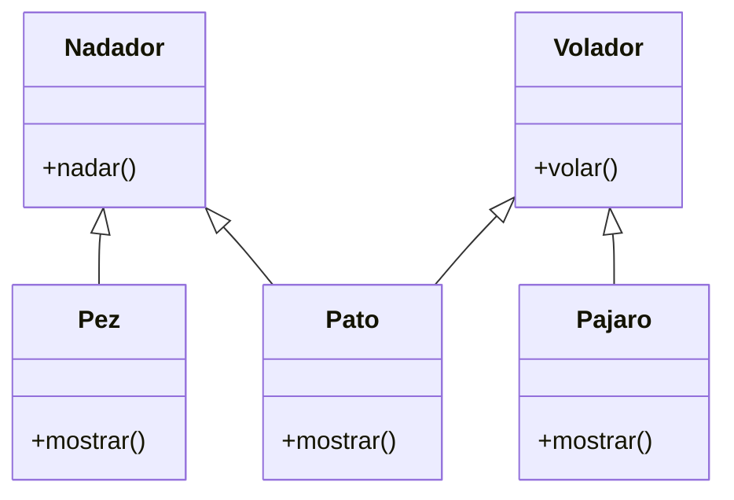

# EJERCICIO 2

Debes desarrollar un videojuego tipo aventura, donde los personajes tiene distintas habilidades
Cada personaje pertenece a uno o más tipos que definen sus comportamientos:
- Nadador: Puede ejecutar la acción nadar(), que representa la acción de desplazarse en el agua.
- Volador: Puede ejecutar la acción volar(), que representa la acción de desplazarse por el aire.
En el juego existen tres personajes principales, cada uno con habilidades específicas:
- Pez: tiene la habilidad de nadar.
- Pájaro: tiene la habilidad de volar.
- Pato: tiene ambas habilidades, puede nadar y volar.
- Cada personaje debe contar con un método mostrar() que indique el tipo de personaje y su habilidad principal o combinada.

## Análisis
### Requisitos
- Los personajes tienen distintas habilidades.
- Nadador tiene la accion de desplazarse por el agua, nadar. 
- Volador tiene la accion de volar.  
- Pez es un personaje de tipo Nadador
- Pajaro es un personaje de tipo Volador
- Pato es un personaje que tiene la habilidad de volar
- Cada personaje debe tener un método mostrar() que indique su tipo y habilidades

### Objetos
- Nadador (Clase padre)
- Volador (Clase padre)
- Pez (Clase Hija)
- Pajaro (Clase Hija)
- Pato (Clase Hija)

### Características 
- Nadador
    - (sin caracteristicas)
- Volador
    - (sin caracteristicas)
- Pez
  - (sin caracteristicas)
- Pajaro
  - (sin caracteristicas)
- Pato
  - (sin caracteristicas)

### Acciones 
- Nadador:
    - nadar()
- Volador:
    - volar()
- Pez:
    - mostrar() 
- Pájaro:
    - mostrar() 
- Pato:
    - mostrar(): 

