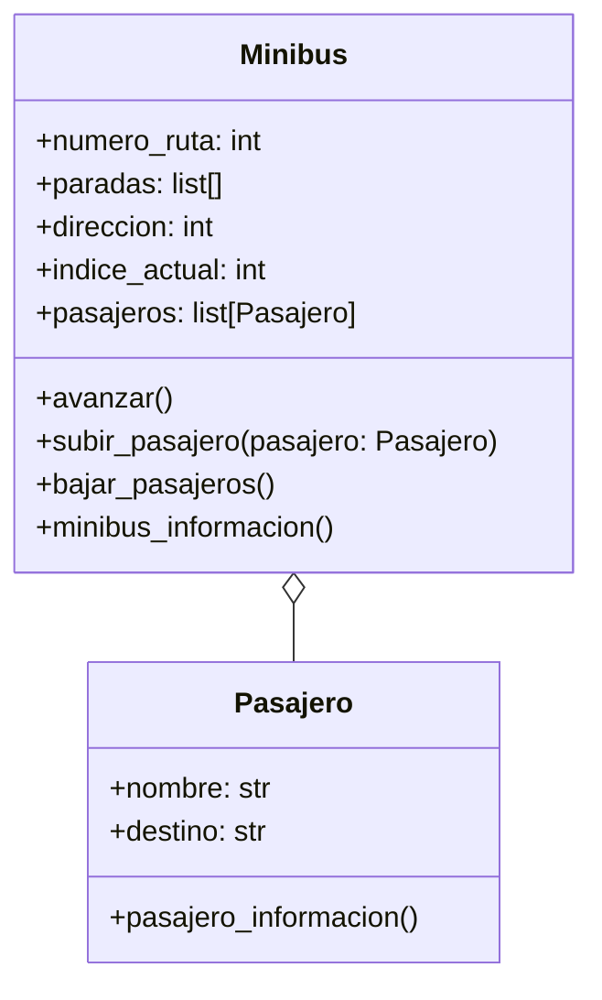

# EJERCICIO 1
En su trayecto diario al trabajo, las personas pueden abordar distintos minibuses. Cada minibus está identificado por un número de ruta y sigue un recorrido compuesto por varias paradas (ubicaciones). Por otro lado, cada pasajero tiene un nombre y una ubicación de destino a la que desea llegar.
Los pasajeros pueden subir o bajar del minibus en cualquier parada, pero bajo las siguientes condiciones:
- Un pasajero solo puede subir si el recorrido del minibus incluye su destino entre las paradas programadas.
- Un pasajero solo puede bajar si la parada actual del minibus coincide con su destino.
- Las paradas son circulares: al llegar al final del recorrido, el minibus invierte su lista de paradas y regresa en sentido contrario.
Diseñar las clases necesarias para representar Minibus y Pasajero.
Toma en cuenta las siguientes características:
Un minibus tiene una lista de paradas programadas (ejemplo: ["Arce", "Prado", "Perez"]).
Un minibus puede transportar múltiples pasajeros.
Simular el movimiento del minibus entre paradas y las acciones de subida y bajada de pasajeros.

## ANALISIS
### Requisitos
- Un pasajero tiene nombre y destino
- Un pasajero sube si el destino enta en el recorrido del minibus
- Un pasajero baja si la parada actual coincide con su destino
- Un Minibus tiene un numero de ruta y rutas programadas
- Un minibus Puede transportar múltiples pasajeros.
- Simular el movimiento del minibus entre paradas y las acciones de subida y bajada de pasajeros.
### Objetos
- Minibus
- Pasajero

### Características
- Minibus
  - numero_ruta: int
  - paradas: list[]
  - direccion: int
  - direccion_actual: int 
  - pasajeros: list[Pasajero]

- Pasajero
  - nombre: String
  - destino: String

### Acciones
- Minibus
  - avanzar()
  - subir_pasajero(pasajero: Pasajero)
  - bajar_pasajeros()
  - minibus_informacion()
- Pasajero
  - pasajero_informacion()

### Diagrama de clases
