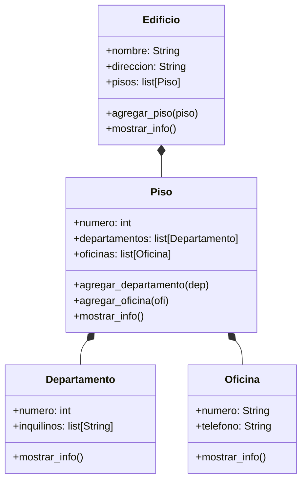

# EJERCICIO 2
Se debe modelar un edificio ubicado en la ciudad de La Paz, compuesto por 3 pisos. Cada piso contiene una combinación de departamentos y oficinas
Cada departamento tiene un número que comienza con el número del piso seguido de un número de unidad (por ejemplo: 201, 304).
Cada oficina tiene un número que comienza con el número del piso seguido de una letra (por ejemplo: 2A, 3C).
Además:
El edificio tiene direccion y nombre.
Los pisos tienen un atributo numero
Las oficinas cuentan con un atributo telefono.
Los departamentos tienen un atributo inquilinos.
El sistema debe permitir:
Crear un edificio con sus pisos correspondientes.
Agregar departamentos y oficinas a cada piso.
Acceder y mostrar la información del edificio de forma organizada y jerárquica
Realiza el análisis y diagrama de clases de las clases Edificio, Piso, Departamento y Oficina en el archivo ejercicio_02.md.
Escribe el código en Python de las clases Edificio, Piso, Departamento y Oficina en el archivo ejercicio_02.py.
Implementa relaciones jerárquicas entre objetos:
Un edificio contiene varios pisos.
Cada piso contiene varios departamentos y oficinas

## ANALISIS
### Requisitos
- El sistema representa un edificio con: direccion y nombre
- El edificio tiene tres pisos enumerados
- Cada piso tiene una combinación de departamentos y oficinas
- Cada oficina tiene un telefono
- Cada departamento tiene una lista de inquilinos
- Se debe agregar departamentos y oficinas a cada piso 

### Objetos
- Edificio
- Piso
- Departamento
- Oficina

### Características
- Edificio
  - nombre: String
  - direccion: String
  - pisos: list[Piso]
- Piso
  - numero: int
  - departamentos: list[Departamento]
  - oficinas: list[Oficina]
- Departamento
  - numero: int
  - inquilinos: list[str]
- Oficina
  - numero: str
  - telefono: str

### Acciones
- Edificio
  - agregar_piso(piso: Piso)
  - mostrar_info()
- Piso
  - agregar_departamento(departamento: Departamento)
  - agregar_oficina(oficina: Oficina)
  - mostrar_info(): 
- Departamento
  - mostrar_info()
- Oficina
  - mostrar_info()

### Diagrama de clases

