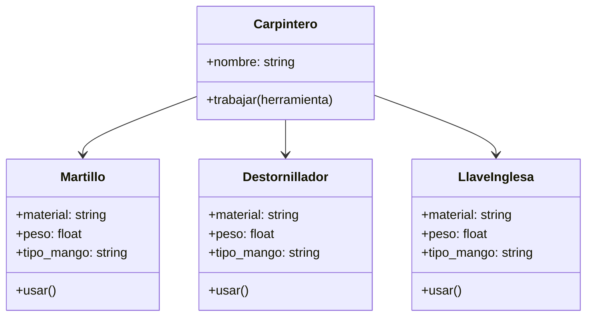

# EJERCICIO 1
En un taller de carpintería, los trabajadores utilizan diferentes herramientas para construir muebles, reparar objetos o ajustar piezas.
Cada herramienta tiene una función específica, pero todas pueden ser utilizadas por el carpintero de manera similar.
Por ejemplo:
- El martillo se usa para clavar clavos
- El destornillador se usa para ajustar tornillos
- La llave inglesa se usa para apretar tuercas
El carpintero no necesita saber el tipo exacto de herramienta que está utilizando, solo necesita que la herramienta pueda ejecutar la acción usar()
- Crea las clases necesarias para representar las herramientas: Martillo, Destornillador y LlaveInglesa.
- Cada clase debe implementar su propio comportamiento en el método usar().

## ANALISIS
### REQUISITOS 
- Se debe modelar las herramientas de un taller de carpinteria.
- Las herramientas de carpinteria son: martillo, destornillador y llave inglesa.
- El carpintero no necesira saber el tipo exacto de herraminenta que este utilizando solo debe ejecutar la accion usar().
- Las herramientes deben tener atributos coherentes como: tipo de mango, material, peso

### OBJETOS 
- Carpintero
- Martillo
- Destornillador
- Llave_inglesa

### CARACTERISTICAS
- Carpintero:
  - nombre: String
- Martillo: 
  - mango: String
  - material: String
  - peso: float
- Destornillador:
  - mango: String
  - material: String
  - peso: float
- Llave_inglesa:
  - mango: String
  - material: String
  - peso: float

### ACCIONES
- Herramienta:
  - usar()
- Martillo:
  - usar()
- Destornillador:
  - usar()
- Carpintero
  - trabajar()

### DIAGRAMA

