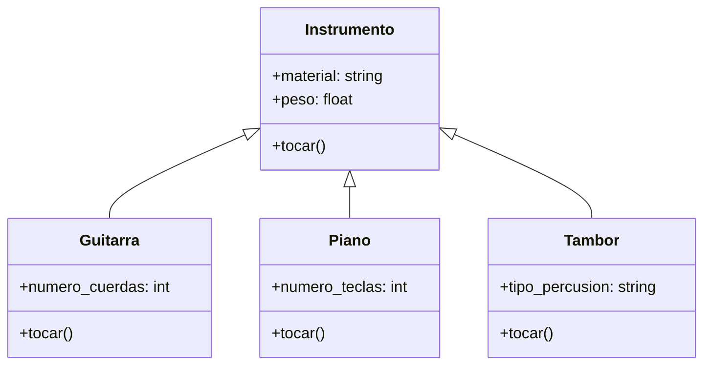

# EJERCICIO 2
Una aplicación de aprendizaje musical permite a los usuarios practicar con distintos instrumentos Cada instrumento tiene una forma particular de producir sonido, pero todos pueden ser tocados por el usuario mediante una acción común.
Por ejemplo:
- La guitarra hace "strum"
- El piano hace "plin"
- El tambor hace "boom"
Aunque cada instrumento suena distinto, todos comparten una característica común:
pueden ejecutar la acción tocar()
- Crea una clase base llamada Instrumento que defina el método tocar().
- Identifica atributos y métodos relevantes para cada instrumento, considerando su función y comportamiento.
- Implementa las clases derivadas Guitarra, Piano y Tambor, cada una con su propia versión del método tocar() que imprima su sonido característico.
Asegúrate de que las clases incluyan atributos y métodos coherentes con su propósito (por ejemplo, número de cuerdas, tipo de percusión, material).
## ANALISIS
### REQUISITOS
- Los instrumentos tienen una forma particular de producir sonidos
- Los instrumentos pueden ser tocados por el usuario mediante una accion comun
- Los instrmentos son guitarra, piano y tambor, y hacen los sonidos "strum", "plin" y "boom" respectivamente
- La claser instrumento tiene el metodo tocar
- Las clases deberan incluir aatributos y metodos coherentes con su proposito

### OBJETOS
- Instrumento
- Guitarra
- Piano
- Tambor
### CARACTERISTICAS
- Instrumento:
  - material: String
  - peso: float
- Guitarra:
  - numero_cuerdas: int
- Piano:
  - numero_teclas: int
- Tambor:
  - tipo_percusion: String

### ACCIONES
- Instrumento:
  - tocar()
- Guitarra:
  - tocar()
- Piano:
  - tocar()
- Tambor:
  - tocar()

