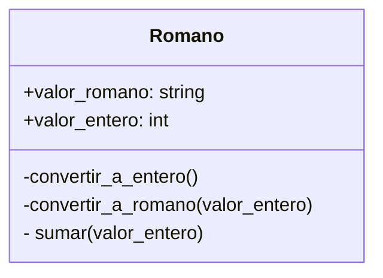

# EJERCICIO 3
Un profesor de matemáticas utiliza una calculadora de números romanos para enseñar aritmética clásica. Cada número se representa mediante una letra o combinación de letras romanas, como:
I = 1
V = 5
X = 10
L = 50
C = 100
Crea la clase Romano que permita sumar números romanos usando el operador +
num1 = Romano("X")   # 10  
num2 = Romano("V")   # 5
resultado = num1 + num2
El resultado debe ser un nuevo objeto de tipo Romano con el valor "XV" (equivalente a 15).
Esto se logra mediante la sobrecarga del operador +, definiendo su comportamiento dentro de la clase Romano.
Realiza el análisis y diagrama de clases para las clase Romano en el archivo ejercicio_03.md.
Escribe el código en Python para las clases Romano en el archivo ejercicio_03.py.
Asegúrate de que las clases incluyan atributos y métodos coherentes con su propósito
Utiliza buenas prácticas de nomenclatura, encapsulamiento y legibilidad

## ANALISIS 
### REQUISITOS
- Respresentar los numeros romanos 
- Sumar dos objetos de numeros romanos usando +
- La suma devuelve otro numero romano'
- Los valores seben pasar a numeros enteros para operar y luego volverlos a romanos

### OBJETOS
- Romano
  
### CARACTERISTICAS
- valor_romano: str
- valor_entero: int

### ACCIONES
- convetir_a_entero()
- convertir_a_romano()
- sumar()

### DIAGRAMA
