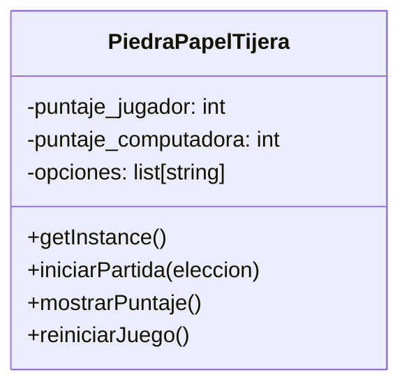

# Análisis

## Requisitos

- Debe existir una única instancia del juego, porque el puntaje debe mantenerse centralizado y compartido entre todas las partidas que el jugador ejecute.
- El jugador compite contra la computadora. La computadora debe elegir aleatoriamente entre piedra, papel y tijera.
- El juego debe permitir ejecutar una partida donde se compare lo elegido por el jugador contra lo que selecciona la computadora.
- Se debe llevar el registro total del puntaje acumulado en la misma instancia.
- Se requiere un menú que permita iniciar partida, mostrar puntajes, reiniciar el juego o salir.
- El Singleton debe manejar su propio estado de puntajes, porque es la parte del sistema que da continuidad al juego.
- El jugador no es un objeto separado, porque no requiere atributos persistentes. Solo elige una opción en cada ronda.

## Objetos

- PiedraPapelTijera

## Características

- PiedraPapelTijera:
  - opciones
  - puntaje_jugador
  - puntaje_computadora

## Acciones
-PiedraPapelTijera:
  - iniciar_partida(): 
  - mostrar_puntaje(): 
  - reiniciar_juego(): 

## Diagrama de Clases

