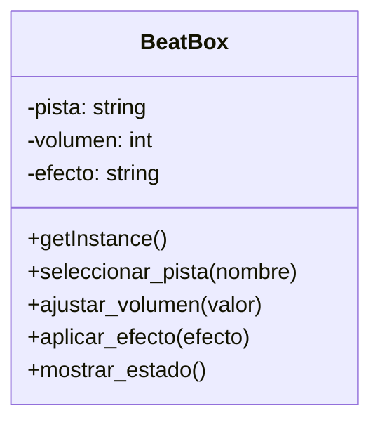

# Análisis

## Requisitos

- Debe existir una unica consola BeatBox, porque la mezcla de audio debe centralizar su estado en un solo lugar.
- El usuario puede seleccionar una pista y esta debe mantenerse como la pista activa dentro de la instancia unica.
- Se debe ajustar el volumen hacia arriba o hacia abajo. El volumen debe ser un valor persistente mientras el programa sigue activo.
- Solo un efecto de sonido puede estar activo a la vez. No deben estar varios efectos activos.
- El sistema debe mostrar un menu que permita modificar la pista, el volumen, aplicar un efecto y ver el estado actual.
- Los efectos validos son eco, reverb y distorsión.

## Objetos

- BeatBox

## Características

- BeatBox:
  - pista
  - volumen
  - efecto

## Acciones
- Beatbox
  - seleccionar_pista()
  - ajustar_volumen()
  - aplicar_efecto()
  - mostrar_estado()

## Diagrama de Clases

