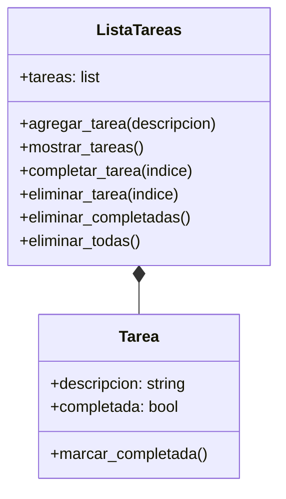

# ANALISIS

## Requisitos 
- El sistema debe permitir crear tareas ingresando una descripción.
- Cada tarea debe tener un estado que indique si está pendiente o completada.
- El usuario debe poder ver la lista completa de tareas registradas.
- El sistema debe permitir marcar una tarea como completada.
- El usuario debe poder eliminar una tarea específica usando su posición en la lista.
- El sistema debe permitir eliminar únicamente las tareas completadas.
- El usuario debe poder eliminar todas las tareas registradas.
- El programa debe funcionar mediante un menú en consola y repetirse hasta que el usuario decida salir.

## Objetos

- Tarea
- ListaTareas

## Caracteristicas

- Tarea:
  - descripcion
  - completada

- ListaTareas:
  - tareas 

## Acciones

- Tarea:
  - marcar_completada()

- ListaTareas:

  - agregar_tarea(descripcion)
  - mostrar_tareas()
  - completar_tarea(indice)
  - eliminar_tarea(indice)
  - eliminar_completadas()
  - eliminar_todas()

## Diseño
### Clases:
- Tarea:
  - Atributos:
    - descripcion
    - completada
  - Metodos:

    - marcar_completada

- ListaTareas:
  - Atributos:
    - tareas
  - Metodos:

    - agregar_tarea
    - mostrar_tareas
    - completar_tarea
    - eliminar_tarea
    - eliminar_completadas
    - eliminar_todas

## Diagrama de clases

