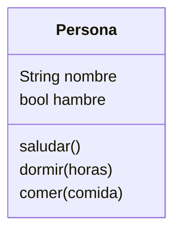

Crearemos un juego similar a Sims llamado `PyLife`
Las personas creadas tienen un nombre y
pueden saludar diciendo su nombre
Ahora las personas pueden dormir una cantidad de horas
En el juego ahora las personas pueden
tener hambre y comer para saciarla
Cuando duerme la persona despierta con hambre

# Análisis

Requisitos:
- Crear personas
- Las personas tienen un nombre
- Las personas pueden saludar
- Tiene un constructor que crea personas con nombre
- Las personas pueden dormir
- Las personas pueden comer
- Al despertar tienen hambre

Objetos:
- Persona

Características:
- Persona: Nombre, hambre

Acciones:
- Persona: Saludar, dormir, comer

